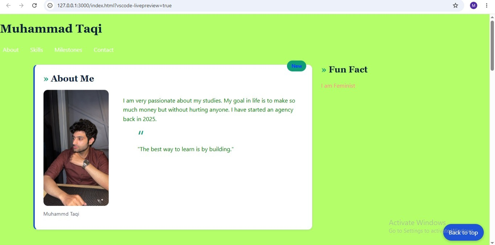
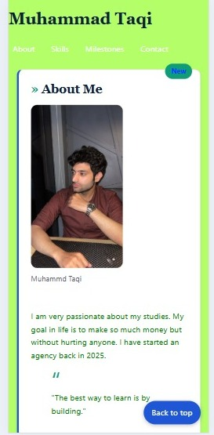

# My Styled Profile Page
 
CIT331 Lab 3. A responsive profile page styled with CSS3.
 
## What this demonstrates
- Selectors, specificity and the cascade
- Box model cards, positioning (sticky header, badge, fixed button)
- Flexbox for components and CSS Grid with named areas for the page layout
- Mobile-first responsive design with two breakpoints
- CSS variables, contrast-checked colors and visible keyboard focus
 

 ## Screenshots

